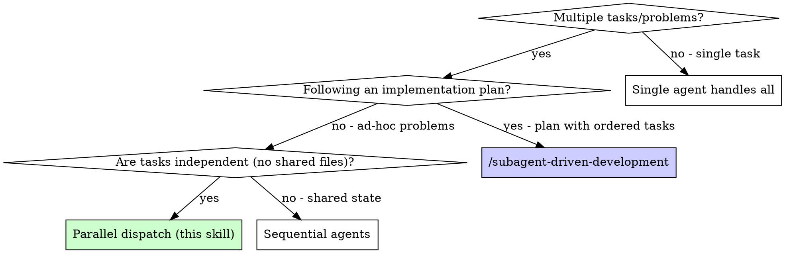

# Dispatching Parallel Agents

## Overview

When you have multiple **independent problems** to solve (different bugs, different subsystems, different investigations), dispatch one agent per problem and let them work concurrently.

**Core principle:** One agent per independent problem domain. Concurrent execution. No shared state.

**This skill is for: solving N independent problems in parallel.**
**NOT for: executing a sequential implementation plan** — use /subagent-driven-development for that.

## When to Use



**Use when:**
- 2+ independent problems (bugs, failures, investigations) across different domains
- Each problem can be understood and solved without context from others
- Agents won't edit the same files
- No implementation plan — just problems to fix

**Don't use when:**
- Following an implementation plan (use /subagent-driven-development)
- Failures are related (fix one might fix others)
- Need to understand full system state first
- Agents would interfere (editing same files)

## The Pattern

### 1. Identify Independent Domains

Group failures by what's broken (按领域模块分组):
- Certificate domain: 证书同步、拓扑构建
- SubDomain domain: 子域名 CRUD、DNS 集成
- WorkOrder domain: 工单创建、状态流转

Each domain is independent - fixing Certificate doesn't affect WorkOrder tests.

### 2. Create Focused Agent Tasks

Each agent gets:
- **Specific scope:** One test file or subsystem
- **Clear goal:** Make these tests pass
- **Constraints:** Don't change other code
- **Expected output:** Summary of what you found and fixed

### 3. Dispatch in Parallel

```
// 在 Cursor 中使用 Task 工具并行调度
Task("Fix certificate manager test failures")
Task("Fix subdomain repository test failures")
Task("Fix workorder usecase test failures")
// All three run concurrently
```

### 4. Review and Integrate

When agents return:
- Read each summary
- Verify fixes don't conflict
- Run `make test && make lint` to verify
- Integrate all changes

## Agent Prompt Structure

Good agent prompts are:
1. **Focused** - One clear problem domain
2. **Self-contained** - All context needed to understand the problem
3. **Specific about output** - What should the agent return?

```markdown
Fix the 3 failing tests in internal/certificate/usecase/manager_test.go:

1. TestManager_SyncCertificate - expects cert to be updated but got nil
2. TestManager_GetExpiredCerts - returns wrong count
3. TestManager_BuildTopology - missing edge connections

These are likely mock setup or assertion issues. Your task:

1. Read the test file and understand what each test verifies
2. Identify root cause - mock expectations or actual bugs?
3. Fix by:
   - Correcting mock EXPECT setup with proper DoAndReturn
   - Fixing bugs in implementation if found
   - Ensuring complete mock response structs

Do NOT just skip assertions - find the real issue.

Return: Summary of what you found and what you fixed.
```

## Common Mistakes

**❌ Too broad:** "Fix all the tests" - agent gets lost
**✅ Specific:** "Fix internal/certificate/usecase/manager_test.go" - focused scope

**❌ No context:** "Fix the race condition" - agent doesn't know where
**✅ Context:** Paste the error messages and test names

**❌ No constraints:** Agent might refactor everything
**✅ Constraints:** "Do NOT change production code" or "Fix tests only"

**❌ Vague output:** "Fix it" - you don't know what changed
**✅ Specific:** "Return summary of root cause and changes"

## vs. Subagent-Driven Development

| | Parallel Agents (this skill) | Subagent-Driven Development |
|---|---|---|
| **Input** | Ad-hoc problems/failures | Implementation plan from /writing-plans |
| **Execution** | All agents run concurrently | One task at a time, sequentially |
| **Review** | Post-integration only | Two-stage review after each task |
| **When** | Multiple independent bugs/issues | Building features from a plan |
| **Agent count** | N agents simultaneously | 1 implementer + 2 reviewers per task |
| **Coordination** | None (independent) | Controller orchestrates sequence |

**Rule of thumb:** "Fix N broken things" → this skill. "Build something from a plan" → /subagent-driven-development.

## When NOT to Use

**Related failures:** Fixing one might fix others - investigate together first
**Need full context:** Understanding requires seeing entire system
**Exploratory debugging:** You don't know what's broken yet
**Shared state:** Agents would interfere (editing same files, using same resources)
**Implementation plan:** Use /subagent-driven-development for planned, sequential work

## Real Example from Session

**Scenario:** 6 test failures across 3 domains after major refactoring

**Failures:**
- internal/certificate/usecase/manager_test.go: 3 failures (mock setup issues)
- internal/subdomain/adapter/repository/subdomain_test.go: 2 failures (GORM query issues)
- internal/workorder/usecase/manager_test.go: 1 failure (gateway mock incomplete)

**Decision:** Independent domains - Certificate 独立于 SubDomain 独立于 WorkOrder

**Dispatch:**
```
Agent 1 → Fix internal/certificate/usecase/manager_test.go
Agent 2 → Fix internal/subdomain/adapter/repository/subdomain_test.go
Agent 3 → Fix internal/workorder/usecase/manager_test.go
```

**Results:**
- Agent 1: 修正 mock.EXPECT 的 DoAndReturn 设置
- Agent 2: 修复 GORM Preload 导致的 N+1 查询问题
- Agent 3: 补全 Gateway mock 返回的结构体字段

**Integration:** All fixes independent, no conflicts, `make test` green

**Time saved:** 3 problems solved in parallel vs sequentially

## Key Benefits

1. **Parallelization** - Multiple investigations happen simultaneously
2. **Focus** - Each agent has narrow scope, less context to track
3. **Independence** - Agents don't interfere with each other
4. **Speed** - 3 problems solved in time of 1

## Verification

After agents return:
1. **Review each summary** - Understand what changed
2. **Check for conflicts** - Did agents edit same code?
3. **Run full suite** - `make test && make lint` verify all fixes work together
4. **Spot check** - Agents can make systematic errors

## Real-World Impact

From debugging session (2025-10-03):
- 6 failures across 3 files
- 3 agents dispatched in parallel
- All investigations completed concurrently
- All fixes integrated successfully
- Zero conflicts between agent changes
