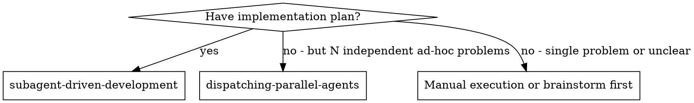
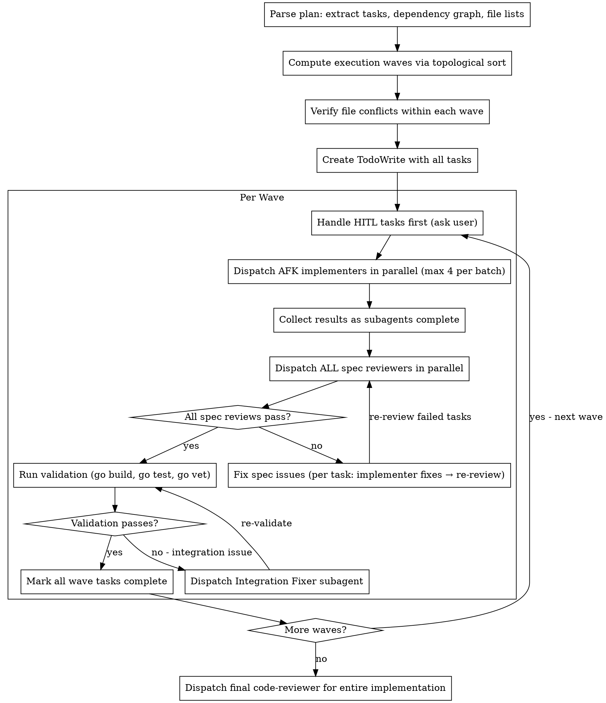

# Subagent-Driven Development

Execute plan by dispatching subagents per task with **dependency-aware parallel scheduling**. Tasks without mutual dependencies run concurrently in waves. Each task gets a spec-compliance review gate (does it build, do tests pass, does it meet the task's acceptance criteria). Architecture and code-quality are reviewed once, globally, after all waves — not per task.

**Core principle:** Dependency graph drives parallelism. Fresh subagent per task. Spec-compliance review gate per task (functional correctness). Global quality review at the end. Maximum concurrency within safety bounds.

## When to Use



- **No dependency graph?** SDD falls back to sequential execution internally (see "Falling Back to Sequential") — a plan without a graph is still executable, just not parallelized.
- **N independent bugs/issues, not a plan?** Use `dispatching-parallel-agents` instead.

**vs. Dispatching Parallel Agents:**
- This skill: **wave-parallel** execution of **planned** tasks with a spec-review gate per task
- Parallel Agents: **concurrent** execution of independent **ad-hoc** problems (bugs, investigations)
- Use `dispatching-parallel-agents` when you have N independent bugs/issues, NOT a plan to execute

## The Process



## Phase 1: Parse Plan & Build Schedule

1. Read the plan file once
2. Extract the **Task Dependency Graph** (the table with "Blocked by" and "Parallelizable with" columns)
3. Extract the **Files** section of each task (Create/Modify lists)
4. Compute execution waves via topological sort:
   - **Wave 0:** tasks with no dependencies (can start immediately)
   - **Wave N:** tasks whose ALL dependencies are in waves < N
5. Verify file safety within each wave (see File Conflict Safety below)
6. Separate HITL from AFK tasks within each wave
7. Create TodoWrite with all tasks, annotated with wave number

### Wave Computation Example

Given dependency graph:
```
Task 1 (AFK) ──┐
                ├── Task 4 (AFK)
Task 2 (AFK) ──┘
Task 3 (HITL) ───── Task 5 (AFK)
```

| Task | Blocked by | Wave |
|------|------------|------|
| 1    | None       | 0    |
| 2    | None       | 0    |
| 3    | None       | 0    |
| 4    | 1, 2       | 1    |
| 5    | 3          | 1    |

→ Wave 0: [Task 1, Task 2, Task 3] — all parallel
→ Wave 1: [Task 4, Task 5] — all parallel (after Wave 0)

## Phase 2: Execute Waves

For each wave, in order:

### Step 1: Handle HITL Tasks

HITL tasks need human decisions before agent can proceed:
1. Present the HITL task to the user with the decision needed
2. Wait for user response
3. Dispatch implementer subagent with the decision as additional context
4. Run spec review (per HITL task)
5. Mark complete

### Step 2: Dispatch AFK Implementers in Parallel

**Concurrency Limit:** Dispatch at most **4 AFK implementers** simultaneously. If a wave (or sub-wave) has more than 4 AFK tasks, split into batches within the wave (e.g., 7 tasks = batch of 4 + batch of 3). This prevents API rate limits and IDE resource exhaustion. Batches within the same wave run sequentially, but tasks within each batch run in parallel.

**Dispatch tasks using multiple Task tool calls in a single message:**

```
// Single message with multiple Task tool calls (max 4):
Task("Implement Task 1: Certificate CRUD")     // Agent A
Task("Implement Task 2: SubDomain DNS")         // Agent B
Task("Implement Task 3: WorkOrder Integration") // Agent C
// All three run concurrently
```

Each subagent gets:
- Full task text from plan (never make subagent read plan file)
- Scene-setting context (where this fits, what was built in prior waves)
- Prior wave outputs if relevant (e.g., "Task 1 created `CertificateRepository` interface at `internal/certificate/usecase/interfaces.go` — you depend on it")

### Step 3: Collect Results

As subagents complete, collect their reports. Wait for ALL implementers in the wave to finish before proceeding to reviews.

### Step 4: Dispatch Spec Reviewers in Parallel

**Dispatch ALL spec reviewers simultaneously** for all completed tasks in the wave:

```
Task("Review spec compliance for Task 1")  // Reviewer A
Task("Review spec compliance for Task 2")  // Reviewer B
Task("Review spec compliance for Task 3")  // Reviewer C
```

The spec reviewer verifies functional correctness only: did the implementer build what the task asked for (nothing more, nothing less), are the acceptance criteria met, and do the claimed tests actually exist and pass. It does NOT do architecture/quality review — that happens once, globally, in Phase 3. Use the `./spec-reviewer-prompt.md` template.

### Step 5: Fix Spec Issues

For each task where spec review found issues:
1. Resume the original implementer subagent to fix issues
2. Re-dispatch spec reviewer
3. Repeat until ✅

Fix loops are **per-task and serialized** (implementer must fix before re-review).
Tasks that pass spec review are ready for wave validation.

### Step 6: Validate & Complete Wave

1. Run validation across the entire project: `go build ./...`, `go test ./...`, `go vet ./...`
2. **If validation fails (Integration Issue):**
   - Individual tasks passed their own tests, but merged code causes build/test failures (e.g., interface mismatch, import cycle, conflicting type definitions).
   - Analyze the error output to identify which tasks' code is conflicting.
   - Dispatch a single **"Integration Fixer"** subagent (`generalPurpose`) with:
     - The exact compilation/test error output
     - The list of files changed by each task in this wave
     - Instructions to resolve the integration conflict with minimal changes
   - Re-run validation after the fix.
   - Repeat until validation passes. If 3 fix attempts fail, **STOP and report** to the user — the plan likely has a design issue that needs human judgment.
3. Mark all wave tasks complete in TodoWrite
4. Proceed to next wave

## Phase 3: Final Review

After all waves complete, dispatch `code-reviewer` subagent for the entire implementation (all files changed across all waves). This is the single, global architecture/code-quality pass — it assumes functional correctness is already verified by the per-task spec reviews and wave validation, and focuses on SOLID, security, and code-judo simplification opportunities.

## File Conflict Safety

Before dispatching parallel implementers within a wave, verify no file conflicts:

1. Read the **Files** section of each task in the wave
2. Build a file → tasks map
3. Check for conflicts:
   - Two tasks **CREATE** the same file → **CONFLICT** — cannot run in parallel
   - Two tasks **MODIFY** the same file → **CONFLICT** — cannot run in parallel
   - One CREATES, another READS → safe (read is implicit, not a conflict)

**If conflicts found within a wave:**
- Split into sub-waves: group non-conflicting tasks together
- Sub-wave A runs first (parallel), then sub-wave B (parallel), etc.
- Log the split decision for transparency

**Example conflict resolution:**
```
Wave 0 has: Task 1, Task 2, Task 3
Task 1 modifies: internal/di/wire.go
Task 2 modifies: internal/di/wire.go  ← conflicts with Task 1
Task 3 modifies: internal/shared/router.go (no conflict)

→ Sub-wave 0a: Task 1, Task 3 (parallel)
→ Sub-wave 0b: Task 2 (after 0a completes)
```

## Prompt Templates

- `./implementer-prompt.md` - Dispatch implementer subagent
- `./spec-reviewer-prompt.md` - Dispatch spec compliance reviewer subagent

### Additional Context for Parallel Implementers

When dispatching parallel implementers, add to each prompt:

```
## Parallel Execution Notice

You are running in parallel with other implementer agents in this wave.
Other agents are working on: [list other task names]

**DO NOT** modify any files outside your task's file list.
Your files: [list from plan]

If you discover you need to modify a file not in your list, STOP and report it
instead of making the change.
```

### Prior Wave Context (Artifact Passing)

When dispatching implementers in Wave N > 0, the Controller **MUST read the actual source files** generated by prior waves and extract the exact signatures/structs that downstream tasks depend on. Subagents need compilable interface definitions, not summaries.

**How the Controller does this:**
1. After a wave completes, identify which files downstream tasks depend on (from "Blocked by" + "Files" sections)
2. Read those files using the Read tool
3. Extract exported interfaces, structs, and function signatures
4. Paste the actual code snippets into the next wave's implementer prompts

See [examples.md](examples.md) for artifact passing template.

## Examples

For full workflow examples including wave execution, concurrency batching, and artifact passing, see [examples.md](examples.md).

## Falling Back to Sequential

If the plan has **no dependency graph** or all tasks share files:
- Fall back to sequential execution (one task at a time)
- The spec-review gate still applies per task
- This is the simplest execution path — no parallelism, but same correctness guarantees

## Red Flags

**Never:**
- Start implementation on main/master branch without explicit user consent
- Skip the spec review gate
- Proceed with unfixed spec issues
- **Dispatch parallel subagents that modify the same files** — verify file lists first
- Make subagent read plan file (provide full text instead)
- Skip scene-setting context (subagent needs to understand where task fits)
- Ignore subagent questions (answer before letting them proceed)
- Accept "close enough" on spec compliance
- Skip review loops (reviewer found issues = implementer fixes = review again)
- Let implementer self-review replace the spec review (both are needed)
- Move to next task/wave while the spec review has open issues
- **Start next wave before current wave fully completes** (dependency violation)

**If subagent asks questions:**
- Answer clearly and completely
- Provide additional context if needed
- Don't rush them into implementation

**If reviewer finds issues:**
- Implementer (same subagent, via resume) fixes them
- Reviewer reviews again
- Repeat until approved
- Don't skip the re-review

**If subagent fails task:**
- Dispatch fix subagent with specific instructions
- Don't try to fix manually (context pollution)

**If wave validation fails (Integration Issue):**
- Dispatch Integration Fixer subagent with exact error output + file lists per task
- Re-validate after fix
- If 3 fix attempts fail, STOP and report to user — likely a design-level issue
- Never skip validation or mark wave complete with failing tests

## Advantages

**vs. Sequential subagent execution:**
- Wave 0 with 3 independent tasks: **3x faster**
- Reviews also parallelized within a wave
- Dependency graph ensures correctness ordering

**vs. Manual execution:**
- Subagents follow TDD naturally
- Fresh context per task (no confusion)
- Parallel-safe (file conflict check before dispatch)
- Subagent can ask questions (before AND during work)

**Quality gates:**
- Self-review catches issues before handoff
- Per-task spec review verifies functional correctness (builds, tests pass, acceptance criteria met)
- Review loops ensure fixes actually work
- Spec compliance prevents over/under-building
- One global architecture/quality review (Phase 3) catches cross-cutting issues without per-task overhead

**Cost:**
- One implementer + one spec reviewer per task (plus the single final code-reviewer)
- Controller does more prep work (parsing DAG, computing waves, checking file conflicts)
- Spec review loops add iterations
- But catches functional issues early (cheaper than debugging later)
- **Parallelism offsets the per-task overhead** — total wall-clock time is reduced

## Integration

**Required workflow skills:**
- `writing-plans` — Creates the plan with dependency graph that this skill executes

**Subagents should use:**
- `test-driven-development` — Subagents follow TDD for each task
- `e2e-testing` — Subagents add E2E tests when implementing API endpoints (E2E tests are planned as tasks, not a separate gate)

**Final review:**
- `code-reviewer` agent — Dispatched once in Phase 3 for the global architecture/quality pass (it loads `code-review-expert` internally)

**Related workflows:**
- `dispatching-parallel-agents` — Use for concurrent independent ad-hoc problems, NOT for plan execution
