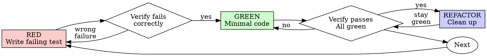

# Test-Driven Development (TDD)

## The Iron Law

```
NO PRODUCTION CODE WITHOUT A FAILING TEST FIRST
```

Write code before the test? **Delete it. Start over.** No keeping as "reference", no adapting.

**Use for:** New features, bug fixes, refactoring, behavior changes.
**Exceptions (ask human):** Throwaway prototypes, generated code, configuration files.

## Red-Green-Refactor



### RED — Write Failing Test

One minimal test showing what should happen.

```go
func TestRetryOperation_RetriesThreeTimes(t *testing.T) {
    attempts := 0
    operation := func() (string, error) {
        attempts++
        if attempts < 3 {
            return "", errors.New("fail")
        }
        return "success", nil
    }

    result, err := RetryOperation(operation)

    assert.NoError(t, err)
    assert.Equal(t, "success", result)
    assert.Equal(t, 3, attempts)
}
```

**Requirements:** One behavior. Clear name (`TestFunctionName_Scenario`). Real code (no mocks unless unavoidable).

### Verify RED — Watch It Fail

**MANDATORY. Never skip.**

```bash
go test -v ./internal/{domain}/usecase/... -run TestRetryOperation
```

Confirm: fails (not errors), failure message is expected, fails because feature missing (not typos).

- Test passes? You're testing existing behavior. Fix test.
- Test errors? Fix error, re-run until it fails correctly.

### GREEN — Minimal Code

Write simplest code to pass the test. Nothing more.

```go
// RetryOperation 重试操作，最多尝试3次
func RetryOperation[T any](fn func() (T, error)) (T, error) {
    var zero T
    var lastErr error
    for i := 0; i < 3; i++ {
        result, err := fn()
        if err == nil {
            return result, nil
        }
        lastErr = err
    }
    return zero, lastErr
}
```

Don't add features, refactor other code, or "improve" beyond the test.

### Verify GREEN — Watch It Pass

**MANDATORY.**

```bash
go test -v ./internal/{domain}/usecase/... -run TestRetryOperation
make test  # Check for regressions
```

Confirm: test passes, other tests still pass, output pristine.

- Test fails? Fix code, not test.
- Other tests fail? Fix now.

### REFACTOR — Clean Up

After green only: remove duplication, improve names, extract helpers. Keep tests green. Don't add behavior.

## Good Tests

| Quality | Good | Bad |
|---------|------|-----|
| **Minimal** | One thing. "and" in name? Split it. | `test('validates email and domain and whitespace')` |
| **Clear** | Name describes behavior | `test('test1')` |
| **Shows intent** | Demonstrates desired API | Obscures what code should do |

## Example: Bug Fix

**Bug:** Empty email accepted

**RED**
```go
func TestSubmitForm_RejectsEmptyEmail(t *testing.T) {
    result, err := SubmitForm(context.Background(), &FormData{Email: ""})
    assert.Nil(t, result)
    assert.Error(t, err)
    assert.Equal(t, "email required", err.Error())
}
```

**Verify RED** → `FAIL: expected error "email required", got nil`

**GREEN**
```go
func SubmitForm(ctx context.Context, data *FormData) (*Result, error) {
    if strings.TrimSpace(data.Email) == "" {
        return nil, utils.BadRequestError("email required")
    }
    // ...
}
```

**Verify GREEN** → `PASS`

**REFACTOR** → Extract validation for multiple fields if needed.

## Verification Checklist

Before marking work complete:

- [ ] Every new function/method has a test
- [ ] Watched each test fail before implementing
- [ ] Each test failed for expected reason (feature missing, not typo)
- [ ] Wrote minimal code to pass each test
- [ ] All tests pass
- [ ] Output pristine (no errors, warnings)
- [ ] Tests use real code (mocks only if unavoidable)
- [ ] Edge cases and errors covered

Can't check all boxes? You skipped TDD. Start over.

## When Stuck

| Problem | Solution |
|---------|----------|
| Don't know how to test | Write wished-for API. Write assertion first. Ask your human partner. |
| Test too complicated | Design too complicated. Simplify interface. |
| Must mock everything | Code too coupled. Use dependency injection. |
| Test setup huge | Extract helpers. Still complex? Simplify design. |

## Debugging Integration

Bug found? Write failing test reproducing it. Follow TDD cycle. Never fix bugs without a test.

## References

- `./tdd-rationale.md` — Why TDD matters, common rationalizations, red flags
- `./testing-anti-patterns.md` — Mock pitfalls, test-only methods, incomplete mocks
