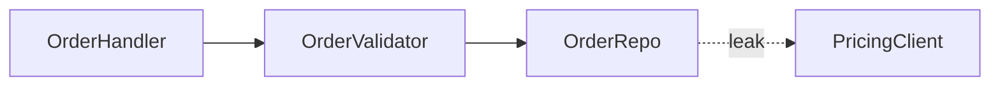

# Markdown Diagram Patterns Reference

Visual patterns for the architecture review report. Use these as guidance when building markdown/Mermaid diagrams (or a simple HTML page if the project already supports it).

## Candidate Card Structure

Each candidate is rendered as a markdown section:

- **Title** — short, names the deepening (e.g. "Collapse the Order intake pipeline").
- **Badge row** — recommendation strength (`Strong` / `Worth exploring` / `Speculative`) and dependency category.
- **Files** — monospaced list.
- **Before / After diagram** — the centrepiece. Use Mermaid or a code block.
- **Problem** — one sentence.
- **Solution** — one sentence.
- **Wins** — bullets, ≤6 words each.

No paragraphs of explanation. If the diagram needs a paragraph to be understood, redraw the diagram.

## Diagram Patterns

Pick the pattern that fits the candidate. Mix them.

### Mermaid graph (dependencies / call flow)

Use a Mermaid `flowchart` when the point is "X calls Y calls Z, and look at the mess."



### Cross-section (layered shallowness)

Use a code block with stacked horizontal bands to show layers a call passes through. Before: 6 thin layers each doing nothing. After: 1 thick band labelled with the consolidated responsibility.

```
Before: Handler → Validator → Mapper → Service → Repo → DB
After:  Handler → OrderPipeline → DB
```

### Mass diagram (interface vs implementation)

Use two code blocks per module. Before: interface block is nearly as tall as implementation block (shallow). After: interface block is short, implementation block is tall (deep).

```
Before:
[OrderValidator interface]  6 methods
[OrderValidator impl]       8 methods

After:
[OrderPipeline interface]   1 method
[OrderPipeline impl]        12 methods
```

### Call-graph collapse

Before: a nested list of function calls. After: the same list collapsed into one module, with internal calls shown as sub-items.

```
Before:
- OrderHandler
  - ValidateOrder
  - MapOrder
  - SaveOrder
    - OrderRepo.Create
    - PricingClient.Get

After:
- OrderPipeline (internal: validate, map, save, pricing)
```

## Top Recommendation Section

One larger section. Candidate name, one sentence on why.

## Tone

Plain English, concise — but the architectural nouns and verbs come straight from [LANGUAGE.md](LANGUAGE.md).

**Use exactly:** module, interface, implementation, depth, deep, shallow, seam, adapter, leverage, locality.

**Never substitute:** component, service, unit (for module) · API, signature (for interface) · boundary (for seam) · layer, wrapper (for module, when you mean module).

**Wins bullets** name the gain in glossary terms: *"locality: bugs concentrate in one module"*, *"leverage: one interface, N call sites"*, *"interface shrinks; implementation absorbs the wrappers"*. Don't write *"easier to maintain"* or *"cleaner code"*.
