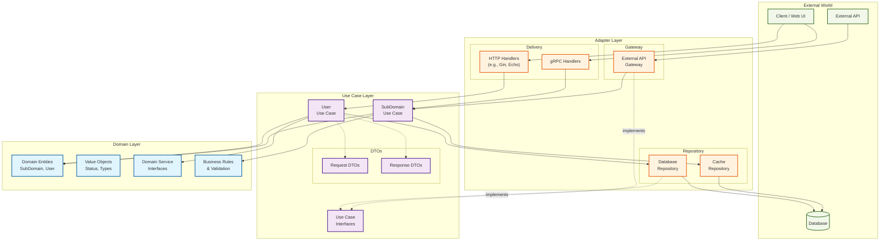

# Go Clean Architecture Template

This repository provides a template for building Go applications following the principles of Clean Architecture. It uses [Google Wire](https://github.com/google/wire) for compile-time dependency injection, promoting a modular, testable, and maintainable codebase.

## Features

- **Clean Architecture**: A clear separation of concerns between business logic and infrastructure.
- **Dependency Injection**: Compile-time DI using Google Wire, avoiding reflection.
- **Structured Logging**: Ready-to-use structured logging setup.
- **Configuration Management**: Environment-based configuration using Viper.
- **Docker Support**: Includes `Dockerfile` and `docker-compose.yaml` for easy setup and deployment.

## Architecture Design

This project strictly adheres to the Clean Architecture principles to ensure the codebase is scalable, maintainable, and easy to test.

### Architectural Diagram

The following diagram illustrates the layered architecture and the Dependency Inversion Principle. All dependencies flow inwards.



### Layer Descriptions

-   **🔵 Domain Layer**: Contains the core business logic and entities. It is the most independent layer and has no dependencies on any other layer.
-   **🟣 Use Case Layer**: Orchestrates the business workflows by interacting with the Domain Layer. It defines interfaces that the Adapter Layer implements.
-   **🟠 Adapter Layer**: Acts as a bridge to the outside world (e.g., UI, databases, external APIs). It implements the interfaces defined by the Use Case Layer.
-   **🟢 External World**: Represents external systems that interact with the application, such as web clients, databases, or third-party services.

### Key Principles

1.  **Dependency Direction**: All dependencies must point inwards. The Domain layer is at the center, and no inner layer can depend on an outer layer. This is the core of Dependency Inversion.
2.  **Interface Segregation**: Interfaces are defined by the consumer (Use Case layer) and implemented by the provider (Adapter layer). This decouples the business logic from the infrastructure details.
3.  **Layer Isolation**: Each layer interacts only with its adjacent layer, maintaining a clear separation of responsibilities.

## Project Structure

```
internal/
├── domain/          # Domain Layer (business entities and rules)
├── usecase/         # Use Case Layer (business logic, interfaces, DTOs)
├── adapter/         # Adapter Layer
│   ├── delivery/    # Delivery mechanisms (e.g., HTTP, gRPC handlers)
│   ├── repository/  # Repository implementations (database access)
│   └── gateway/     # Gateways to external services
└── di/              # Dependency Injection configuration (Wire)
```

## Layer Guidelines

### 1. Domain Layer (`internal/domain/`)

**✅ Should Contain:**
- Core business entities (Structs representing business objects).
- Value Objects.
- Domain Service interfaces.
- Enums and constants related to the domain.

**❌ Should NOT Contain:**
- HTTP request/response structs.
- Application-level concepts like pagination or API-specific data.
- Infrastructure details like JSON tags or database-specific annotations (GORM tags are an exception for simplicity in this template, but in a stricter setup, they could be moved to repository-specific models).

**Example:**
```go
// A core entity
type User struct {
    ID           uint
    Username     string
    Email        string
    Password     string // Hashed password
    CreatedAt    time.Time
}

// A value object
type UserStatus string

const (
    StatusActive   UserStatus = "active"
    StatusInactive UserStatus = "inactive"
)
```

### 2. Use Case Layer (`internal/usecase/`)

**✅ Should Contain:**
- Implementations of specific business use cases (e.g., `CreateUser`, `LoginUser`).
- Interface definitions for dependencies (e.g., `UserRepository`).
- Request and Response DTOs (Data Transfer Objects).
- Application-specific models and logic.

**Example Directory Structure:**
```
usecase/
├── iface/
│   └── repository.go      # Repository interfaces
└── user/
    └── service.go         # User use case implementation
```

**Example DTOs:**
```go
// Request DTO for creating a user
type CreateUserRequest struct {
    Username string `json:"username" validate:"required"`
    Email    string `json:"email" validate:"required,email"`
    Password string `json:"password" validate:"required"`
}

// Response DTO for a user profile
type UserResponse struct {
    ID       uint   `json:"id"`
    Username string `json:"username"`
    Email    string `json:"email"`
}
```

### 3. Adapter Layer (`internal/adapter/`)

**✅ Should Contain:**
- HTTP/gRPC handlers that translate requests into use case calls.
- Database repository implementations that fulfill the interfaces defined in the Use Case layer.
- Clients for external services (gateways).
- Any other infrastructure-related code.

**Dependency Principle:**
```
Delivery -> UseCase -> Domain
Gateway  -> UseCase
Repository -> UseCase
```

## Getting Started

### Prerequisites

- [Go](https://golang.org/dl/) (version specified in `go.mod`)
- [Docker & Docker Compose](https://docs.docker.com/engine/install/)
- [Make](https://www.gnu.org/software/make/)

### Installation

1.  **Clone the repository:**
    ```sh
    git clone https://github.com/your-username/go-clean-arch.git
    cd go-clean-arch
    ```

2.  **Set up environment variables:**
    Create a `.env` file from the sample and fill in your configuration.
    ```sh
    cp .env.sample .env
    ```

3.  **Install development tools and dependencies:**
    This command will install all the necessary Go tools (linter, DI tool, etc.) and download the module dependencies.
    ```sh
    make init
    make dep
    ```

## Development Workflow

This project uses a `Makefile` to streamline common development tasks. Here are some of the most important commands:

-   **`make di`**: Generates the dependency injection code using `wire`. Run this whenever you add or change dependencies in `internal/di/wire.go`.

-   **`make doc`**: Generates Swagger API documentation.

-   **`make lint`**: Runs the linter (`golangci-lint`) to check for code quality and style issues.

-   **`make fmt`**: Formats the entire codebase using `gofumpt` and `golines`.

-   **`make test`**: Runs all unit tests and generates a coverage report (`.coverage.cov`).

-   **`make cov`**: Opens the HTML coverage report in your browser.

-   **`make build`**: Compiles the application and places the binary in the `bin/` directory.

### Running the Application

You can run the application either using Docker or locally.

- **With Docker (Recommended for production-like environment):**
  ```sh
  docker-compose up --build
  ```
  The API will be available at `http://localhost:8000`.

- **Locally (Ideal for development):**
  1.  Ensure you have a running PostgreSQL instance that matches your `.env` configuration.
  2.  Run the application directly:
      ```sh
      go run ./cmd/api/main.go
      ```
  3.  Alternatively, you can build and serve:
      ```sh
      make build
      make serve
      ```
## License

This project is licensed under the MIT License - see the [LICENSE](LICENSE) file for details.
