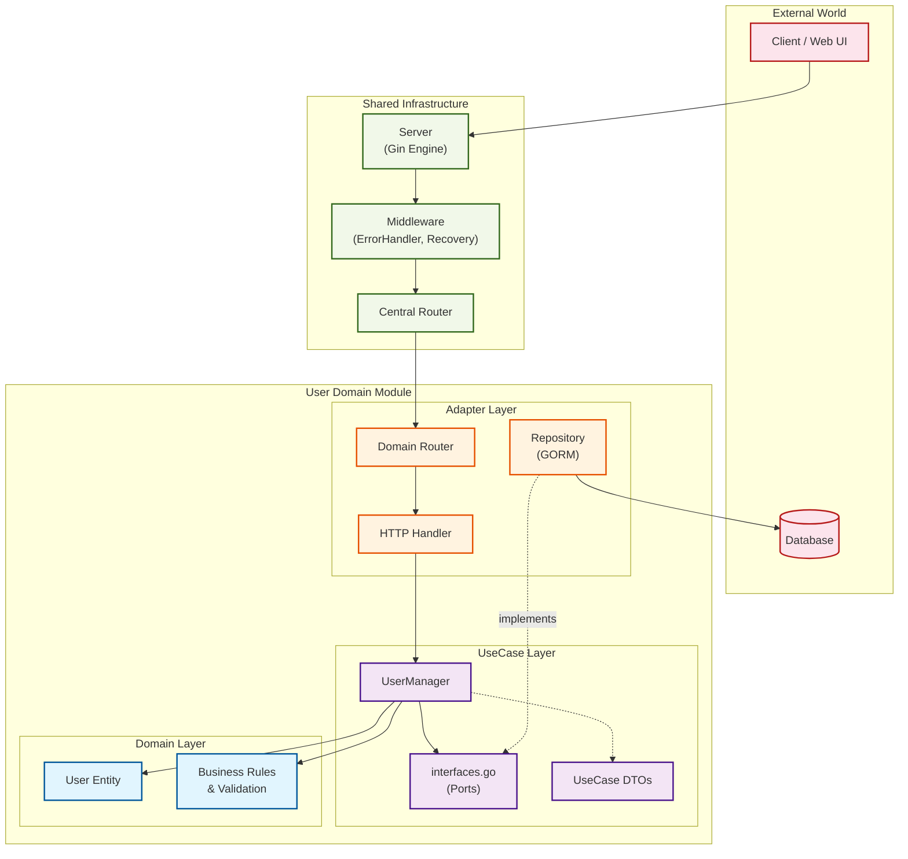

# Go Clean Architecture Template

This repository provides a template for building Go applications following **DDD (Domain-Driven Design) + Clean Architecture** principles. Each bounded context is organized as a self-contained domain module, promoting modularity, testability, and maintainability.

## Features

- **DDD + Clean Architecture**: Domain-first organization with clear layer boundaries.
- **Domain Module Pattern**: Each bounded context has its own `domain/`, `usecase/`, and `adapter/` layers.
- **Dependency Injection**: Compile-time DI using Google Wire with grouped `wire.NewSet` bindings.
- **Unified Error Handling**: `AppError` pattern with ErrorHandler middleware.
- **Structured Logging**: `pkg/log` for JSON-formatted structured logging.
- **Configuration Management**: Environment-based configuration using Viper.
- **Docker Support**: Includes `Dockerfile` and `docker-compose.yaml` for easy setup and deployment.

## Architecture Design

This project adopts a **domain-first** layout where dependency direction flows **only inward**:

```
External World (HTTP, DB, External APIs)
 ↓
Adapter Layer (Delivery, Repository, Gateway)
 ↓
UseCase Layer (Business logic orchestration, interface definitions)
 ↓
Domain Layer (Core entities, business rules)
```

### Architectural Diagram


```mermaid
graph TD
    subgraph "External World"
        Client[Client / Web UI]
        DB[(Database)]
    end

    subgraph "Shared Infrastructure"
        Server["Server<br/>(Gin Engine)"]
        Router["Central Router"]
        MW["Middleware<br/>(ErrorHandler, Recovery)"]
    end

    subgraph "User Domain Module"
        subgraph "Adapter Layer"
            UserHTTP["HTTP Handler"]
            UserRouter["Domain Router"]
            UserRepo["Repository<br/>(GORM)"]
        end

        subgraph "UseCase Layer"
            UserManager["UserManager"]
            UserInterfaces["interfaces.go<br/>(Ports)"]
            UserDTO["UseCase DTOs"]
        end

        subgraph "Domain Layer"
            UserEntity["User Entity"]
            UserRules["Business Rules<br/>& Validation"]
        end
    end

    Client --> Server
    Server --> MW --> Router
    Router --> UserRouter --> UserHTTP
    UserHTTP --> UserManager
    UserManager --> UserInterfaces
    UserRepo -.->|implements| UserInterfaces
    UserManager --> UserEntity
    UserManager --> UserRules
    UserManager -.-> UserDTO
    UserRepo --> DB

    classDef domainStyle fill:#e1f5fe,stroke:#01579b,stroke-width:2px
    classDef usecaseStyle fill:#f3e5f5,stroke:#4a148c,stroke-width:2px
    classDef adapterStyle fill:#fff3e0,stroke:#e65100,stroke-width:2px
    classDef sharedStyle fill:#f1f8e9,stroke:#33691e,stroke-width:2px
    classDef externalStyle fill:#fce4ec,stroke:#b71c1c,stroke-width:2px

    class UserEntity,UserRules domainStyle
    class UserManager,UserInterfaces,UserDTO usecaseStyle
    class UserHTTP,UserRouter,UserRepo adapterStyle
    class Server,Router,MW sharedStyle
    class Client,DB externalStyle
```

### Layer Descriptions

- **Domain Layer**: Core business entities and rules. No dependencies on any other layer.
- **UseCase Layer**: Orchestrates business workflows. Defines port interfaces (`interfaces.go`) that adapters implement.
- **Adapter Layer**: Bridges to the outside world (HTTP handlers, database repositories, external API gateways).
- **Shared Infrastructure**: HTTP server assembly, central router registration, cross-cutting middleware.

### Key Principles

1. **Dependency Direction**: All dependencies point inward. Inner layers never depend on outer layers.
2. **Domain Module Isolation**: Each bounded context (e.g., User) is self-contained with its own layers.
3. **Interface Segregation**: Ports are defined by the consumer (UseCase) and implemented by the provider (Adapter).
4. **Unified Error Handling**: Use `AppError` + `ErrorHandler` middleware instead of ad-hoc error responses.

## Project Structure

```
├── cmd/
│   └── api/
│       └── main.go                              # Entry point
├── internal/
│   ├── user/                                    # User domain module
│   │   ├── domain/                              # Domain entities & business rules
│   │   │   └── user.go
│   │   ├── usecase/                             # Business logic orchestration
│   │   │   ├── interfaces.go                    # Ports (Repository/Gateway interfaces)
│   │   │   ├── user.go                          # UserManager implementation
│   │   │   ├── dto/                             # UseCase-level DTOs
│   │   │   │   └── user.go
│   │   │   └── mock/                            # Generated mocks
│   │   │       └── interfaces.go
│   │   └── adapter/                             # Infrastructure implementations
│   │       ├── delivery/
│   │       │   └── http/
│   │       │       ├── handler/                 # HTTP handlers
│   │       │       │   └── user.go
│   │       │       ├── router/                  # Domain route registration
│   │       │       │   └── user.go
│   │       │       └── dto/                     # HTTP request/response DTOs
│   │       │           └── user.go
│   │       └── repository/                      # Database implementation
│   │           ├── user.go
│   │           └── user_model.go
│   ├── shared/                                  # Shared infrastructure
│   │   └── adapter/
│   │       └── delivery/
│   │           ├── server.go                    # HTTP server assembly
│   │           └── http/
│   │               ├── router/
│   │               │   └── router.go            # Central route registration
│   │               └── middleware/
│   │                   └── error_handler.go     # Unified error handling
│   └── di/                                      # Dependency injection (Wire)
│       ├── wire.go
│       └── wire_gen.go
└── pkg/                                         # Shared libraries
    ├── auth/                                    # JWT token service
    ├── config/                                  # Configuration loading
    ├── crypto/                                  # Password hashing
    ├── db/                                      # Database connection
    ├── log/                                     # Structured logging
    └── utils/                                   # AppError and utilities
```

## Adding a New Domain Module

To add a new domain module (e.g., `article`):

1. **Create the domain entity**: `internal/article/domain/article.go`
2. **Define use case ports**: `internal/article/usecase/interfaces.go`
3. **Implement the manager**: `internal/article/usecase/article.go`
4. **Create use case DTOs**: `internal/article/usecase/dto/article.go`
5. **Implement the repository**: `internal/article/adapter/repository/article.go`
6. **Create HTTP handler**: `internal/article/adapter/delivery/http/handler/article.go`
7. **Register routes**: `internal/article/adapter/delivery/http/router/article.go`
8. **Register in central router**: Add `RegisterArticleRoutes` call to `internal/shared/adapter/delivery/http/router/router.go`
9. **Wire DI**: Add providers to `internal/di/wire.go` sets and regenerate with `make di`

## AI-Assisted Development (Cursor)

This project is deeply integrated with Cursor AI workflows. Skills, Subagents, and Rules enable fully automated development from requirements to production-ready code.

### `/go` — End-to-End Development (Recommended)

Type `/go` followed by a requirement description in Cursor, and AI will complete the full development lifecycle automatically:

```
/go Add an Article domain module with CRUD operations and pagination
```

The 5 automated stages:

```
┌──────────────┐    ┌──────────────┐    ┌──────────────┐    ┌──────────────┐    ┌──────────────┐
│ 1. Require-  │───▶│ 2. Design &  │───▶│ 3. Code      │───▶│ 4. Code      │───▶│ 5. Code      │
│    ments     │    │    Planning  │    │ Implementa-  │    │    Review    │    │ Simplifi-    │
│ brainstorming│    │writing-plans │    │executing-plans│    │code-reviewer │    │code-simplifier│
│ ⬆ Only human │    │  Automatic   │    │  Automatic   │    │  Automatic   │    │  Automatic   │
│  interaction │    │              │    │              │    │              │    │              │
└──────────────┘    └──────────────┘    └──────────────┘    └──────────────┘    └──────────────┘
```

- **Only step 1** requires human confirmation; steps 2-5 run fully automatically
- Each step includes build verification (`go build`, `go vet`)
- Issues found during review are auto-fixed and re-verified

### Skills

Skills are reusable AI workflow instructions located in `.cursor/skills/`:

| Category | Skill | Purpose | Trigger |
|----------|-------|---------|---------|
| **Flow** | `go` | End-to-end automated development (recommended) | `/go` + description |
| **Flow** | `brainstorming` | Requirements exploration, outputs design spec | Auto-triggered before feature creation |
| **Planning** | `writing-plans` | Write step-by-step implementation plans (with TDD) | Multi-step tasks with specs |
| **Execution** | `executing-plans` | Execute plans in batches with checkpoints | Separate session plan execution |
| **Execution** | `subagent-driven-development` | Subagent-driven, one agent per task | Current session plan execution |
| **Execution** | `dispatching-parallel-agents` | Dispatch multiple agents in parallel | 2+ independent tasks |
| **Execution** | `test-driven-development` | TDD-driven development | New features, bug fixes |
| **Review** | `code-review-expert` | SOLID / security / architecture review | Review git changes |

### Subagents

Subagents are specialized agents automatically dispatched during the `/go` pipeline:

| Agent | Purpose | When Dispatched |
|-------|---------|-----------------|
| `code-reviewer` | Review code changes, detect SOLID violations and security risks | `/go` step 4 (automatic) |
| `code-simplifier` | Simplify code, reduce complexity while preserving behavior | `/go` step 5 (automatic) |

### Rules

Rules provide persistent project-level coding standards for AI, located in `.cursor/rules/`:

| Rule | Scope | Description |
|------|-------|-------------|
| `00-project-overview` | Global | Project architecture, tech stack, directory structure |
| `01-code-style` | Global | Naming, error handling, logging, Context passing |
| `02-best-practices` | `**/*.go` | Security, performance, config management, dev workflow |
| `10-domain-layer` | `**/domain/*.go` | Domain entity definitions, status types |
| `11-usecase-layer` | `**/usecase/**/*.go` | UseCase Manager, interfaces, DTO conventions |
| `12-handler-layer` | `**/delivery/http/**/*.go` | HTTP Handler flow, error delegation |
| `13-repository-layer` | `**/repository/*.go` | GORM models, data operations, model mapping |
| `14-gateway-layer` | `**/gateway/**/*.go` | External service gateway conventions |
| `15-task-layer` | `**/delivery/task/*.go` | Background task conventions |
| `20-wire-di` | `**/di/*.go` | Wire dependency injection organization |
| `30-testing` | `**/*_test.go` | TDD workflow, table-driven tests, mocking |
| `40-api-swagger` | handler files | Swagger annotation conventions |
| `session-continuation` | Global | Session continuation with next-step suggestions |

### Step-by-Step Usage

If you prefer not to use `/go`, you can trigger individual skills:

```
# Explore requirements first
/brainstorming I want to add a tag management module

# After design is confirmed, generate implementation plan
/writing-plans Create an implementation plan based on the confirmed design

# Execute the plan
/executing-plans Execute docs/plans/2026-04-07-tag-module.md

# Review after completion
/code-review-expert Review the current git changes
```

## Getting Started

### Prerequisites

- [Go](https://golang.org/dl/) (version specified in `go.mod`)
- [Docker & Docker Compose](https://docs.docker.com/engine/install/)
- [Make](https://www.gnu.org/software/make/)

### Installation

1. **Clone the repository:**
    ```sh
    git clone https://github.com/your-username/go-clean-arch.git
    cd go-clean-arch
    ```

2. **Set up environment variables:**
    ```sh
    cp .env.sample .env
    ```

3. **Install development tools and dependencies:**
    ```sh
    make init
    make dep
    ```

## Development Workflow

| Command | Description |
|---------|-------------|
| `make build` | Build the application |
| `make serve` | Build and start the server |
| `make di` | Generate Wire dependency injection code |
| `make doc` | Generate Swagger API documentation |
| `make lint` | Run linter (golangci-lint) |
| `make test` | Run tests with coverage |
| `make fmt` | Format code (gofumpt + golines) |
| `make mock` | Generate mocks (mockgen) |

### Running the Application

- **With Docker:**
  ```sh
  docker-compose up --build
  ```

- **Locally:**
  ```sh
  go run ./cmd/api/main.go
  ```

## License

This project is licensed under the MIT License - see the [LICENSE](LICENSE) file for details.
